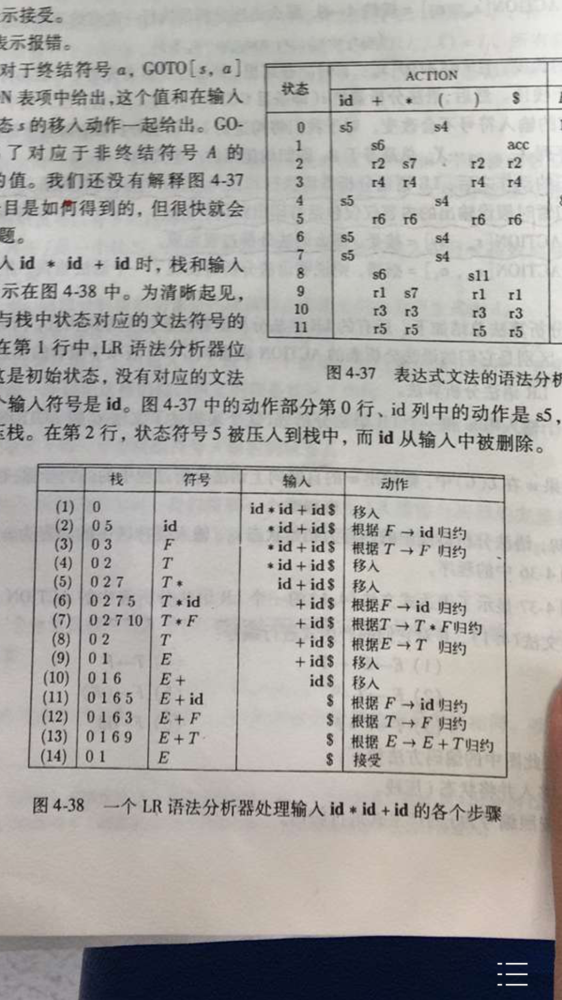

# 简化版LEX报告

## 目录
   
* [项目描述(介绍+假设)](#1)
* [模块设计及中间结果校验(算法+数据结构+注意问题+测试)](#2)
* [使用说明及系统测试](#3) (如果想测试运行请看这一部分)
* [个人感受和总结](#4)

<br>
<br>

## 1. 项目描述

&emsp;&emsp; yacc（Yet Another Compiler Compiler），是Unix/Linux上一个用来生成编译器的编译器（编译器代码生成器）。yacc生成的编译器主要是用C语言写成的语法解析器（Parser），需要与词法解析器Lex一起使用，再把两部分产生出来的C程序一并编译。yacc本来只在Unix系统上才有，但现时已普遍移植往Windows及其他平台。

&emsp;&emsp; yacc的输入是巴科斯范式（BNF）表达的语法规则以及语法规约的处理代码，Yacc输出的是基于表驱动的编译器，包含输入的语法规约的处理代码部分。

&emsp;&emsp; yacc是开发编译器的一个有用的工具，采用LALR（1）语法分析方法    

(以上内容摘录自[维基百科](https://zh.wikipedia.org/wiki/Yacc)):


因个人能力有限,只实现了一个非常简单的yacc(LR(1))版本  
假设:  
  
>> 1. 要在输入文件开始声明要用到的终止符非终止符
>> 2. 输入文件不支持注释
>> 3. 产生式左部要紧跟 ':' ,不能有空格
>> 3. 终止符和非终止声明不支持换行声明,production支持换行
>> 4. 两个字符之间要有空格, ':'之后要有空格
>> 5. 不能自定义处理二义文法
>> 6. 有错误处理机制

例如:  
输入中non_terminal代表非终止符, terminal代表终止符, production代表产生式.
```
non_terminal: E T F

terminal: + * ( ) id

production:

E: E + T
E: T
T: T * F
T: F
F: ( E )
F: id
```
输出yacc.py程序, 运行yacc.py程序对如下输入处理
```
python yacc.py yacc.txt yacc.txt
```
```
if aaaab asd
```
输出: 
```
if  ex1  ex2  
```

<br>
<br>

## 2. 模块设计和中间结果校验

### 2.0 主要数据结构(YaccDataStructures.py)
> 1. 产生式   Production
``` python
class Production(object):
    non_terminal_syms = []
    terminal_syms = []

    def __init__(self, left, right):
        self.left = left
        self.right = right
```
其中right以如下方式存储: 
``` python
right = [symbol1, symbol2......]
```


> 2. LR(1)项 Item
``` python
class Item(object):
    """
    LR1 item
    """
    
    @classmethod
    def from_production(cls, prd, next_predict):
        item = Item(prd, next_predict, 0)
        # item.predict_next(firsts)
        return item

    def __init__(self, production, next_predict, index):
        """
        :param production: 产生式 
        :param next_predict: 预测项
        :param index: 当前 . 的位置
        """
        self.production = production
        self.next_predict = next_predict
        self.index = index
``` 
其中next_predict通过以下方式存储:
```
next_predict = set(T1, T2, T3......)
```

> 2. 状态 State 
``` python
class State(object):
    """
    状态
    """

    def __init__(self, items):
        """
        :param items: 该状态内的item
        """
        self.items = items
```

通过自定义__str__方法来展示对应的状态图:
``` cpp
( S' -> .E , {'$'})
( E -> .E + T , {'+', '$'})
( E -> .T , {'+', '$'})
( T -> .T * F , {'+', '$', '*'})
( T -> .F , {'+', '$', '*'})
( F -> .( E ) , {'+', '$', '*'})
( F -> .id , {'+', '$', '*'}) 
```

### 2.1 输入模块(LexInput.py)

流程: 
> 1. 读入输入文件的每一行
>> 1. 如果是空行跳过
>> 2. 如果是非终止符,读入非终止符号集合
>> 3. 如果是终止符, 读入紧随其后的终止符集合
>> 4. 如果是产生式, 读入紧随其后的产生式集合
> 2. 在非终止符集合中插入S', 产生式集合中插入零号产生式
> 3. 返回三个集合

注意:
> 最简单模块,没有什么值得注意的

例子:  
```
non_terminal: E T F

terminal: + * ( ) id

production:

E: E + T
E: T
T: T * F
T: F
F: ( E )
F: id
```
>输出:  
``` cpp
[S' -> E , E -> E + T , E -> T , T -> T * F , T -> F , F -> ( E ) , F -> id ]

Non terminal: ["S'", 'E', 'T', 'F']

Terminal: ['+', '*', '(', ')', 'id']
```


### 2.2 计算所有非终止符的fisrt(YaccFuncs.py)
流程:  
下面通过一段简化版代码来说明, 具体可参照龙书或者具体代码
``` python
    for nt in non_terminals:
        productions_of_nt = 所有左侧含有nt的产生式集合
        while is_changed:
            for first_prd in productions_of_nt:
                left = 当前产生式左侧
                right = 当前产生式左侧

                if A->epsilon:
                    FIRST(nt) <- epsilon

                elif A->a:     //a is terminal symbol 
                    FIRST(nt) <- a

                elif A->Bx:
                    if B not contains epsilon:
                        FIRST(nt) <- FIRST(B) //若FIRST(B)还未被求出,留待后面的循环内解决
                    elif B contains epsilon
                        FIRST(nt) <- FIRST(B) + {x}//若FIRST(B)还未被求出,留待后面的循环内解决
    return 所有first
    
```


``` python
def calc_every_first_of_nt(productions, nts):
    """
    计算每一个非终止符的first
    :param productions: 产生式集合
    :param nts: 非终止符集合
    :return: 所有非终止符first集合
    """
```

例子:  
(1) 输入:

``` cpp
[S' -> E , E -> E + T , E -> T , T -> T * F , T -> F , F -> ( E ) , F -> id ]

Non terminal: ["S'", 'E', 'T', 'F']

Terminal: ['+', '*', '(', ')', 'id']
```

输出: 
``` python
{"S'": ['(', 'id'], 'E': ['(', 'id'], 'T': ['(', 'id'], 'F': ['(', 'id']}
```

(2) 输入: 
含有循环左递归
``` 
S': S
S: A a
S: 
A: S d
```

输出:  
``` python
# None 代表 epsilon
{"S'": [None, 'd'], 'S': [None, 'd'], 'A': ['d']}
```
<br>

### 2.3 构建LR1 Table (YaccFuncs.py)
> 1. 状态内扩展 (State内函数)
``` python
    def expand(self, productions, firsts):
        """
        :param productions: 产生式集合
        :param firsts: 所有非终止符first
        :return: 
        """
```
输入: 
``` cpp
before: 
( S' -> .E , {'$'})

产生式:
S': E
E: E + T
E: T
T: T * F
T: F
F: ( E )
F: id
```

输出:
``` cpp
after:
( S' -> .E , {'$'})
( E -> .E + T , {'+', '$'})
( E -> .T , {'+', '$'})
( T -> .T * F , {'*', '+', '$'})
( T -> .F , {'*', '+', '$'})
( F -> .( E ) , {'*', '+', '$'})
( F -> .id , {'*', '+', '$'})
```

> 2. 推导到下一个状态
``` python
    def through_edge(self, edge):
        """
        :param edge: 通过的边
        :return: 
        """
```

例子:  因为逻辑简单,只需移动点位置即可,所以不给出具体例子

>3. LR(1) table 构建完成
例子:
输入:
```
non_terminal: E T F

terminal: + * ( ) id

production:

E: E + T
E: T
T: T * F
T: F
F: ( E )
F: id
```
输出:
比较复杂,建议跳过,看后面的具体语法分析
``` python
[{'E': [1], 'T': [2], 'F': [3], '(': [4], 'id': [5]},
 {'+': [6], '$': ['acc']},
  {'*': [7], '+': [Production('E',['T'])], '$': [Production('E',['T'])]},
   {'*': [Production('T',['F'])], '+': [Production('T',['F'])], '$': [Production('T',['F'])]},
    {'E': [8], 'T': [9], 'F': [10], 'id': [11]},
     {'*': [Production('F',['id'])], '+': [Production('F',['id'])], '$': [Production('F',['id'])]},
      {'T': [12], 'F': [3], '(': [4], 'id': [5]},
       {'F': [13], '(': [4], 'id': [5]},
        {'+': [14], ')': [15]},
         {'*': [16], '+': [Production('E',['T'])], ')': [Production('E',['T'])]},
          {'+': [Production('T',['F'])], ')': [Production('T',['F'])], '*': [Production('T',['F'])]},
           {'+': [Production('F',['id'])], ')': [Production('F',['id'])], '*': [Production('F',['id'])]},
            {'*': [7], '+': [Production('E',['E', '+', 'T'])], '$': [Production('E',['E', '+', 'T'])]},
             {'*': [Production('T',['T', '*', 'F'])], '+': [Production('T',['T', '*', 'F'])], '$': [Production('T',['T', '*', 'F'])]},
              {'T': [17], 'F': [10], '(': [18], 'id': [11]},
               {'*': [Production('F',['(', 'E', ')'])], ')': [Production('F',['(', 'E', ')'])], '+': [Production('F',['(', 'E', ')'])], '$': [Production('F',['(', 'E', ')'])]},
                {'F': [19], '(': [18], 'id': [11]},
                 {'*': [16], '+': [Production('E',['E', '+', 'T'])], ')': [Production('E',['E', '+', 'T'])]},
                  {'E': [20], 'T': [9], 'F': [10], 'id': [11]},
                   {'+': [Production('T',['T', '*', 'F'])], ')': [Production('T',['T', '*', 'F'])], '*': [Production('T',['T', '*', 'F'])]},
                    {'+': [14], ')': [21]},
                     {'+': [Production('F',['(', 'E', ')'])], ')': [Production('F',['(', 'E', ')'])], '*': [Production('F',['(', 'E', ')'])]}]

```

### 2.4 Output部分(YaccOutput.py)

过程:  
>1. 根据输入的lr1 table 构建输出程序
 ``` python
 def yacc_output(lr1_table, path):
    """
    输出yacc程序
    :param lr1_table: lr1 parsing table
    :param path: 要输出的语法分析程序
    :return:
    """
 ``` 
    
>> 例子:  
输入: 
在TestInput.txt中输入的是龙书上的一个例子
使用命令
 ``` sh
 python Main.py ./test/TestInput.txt ./test/yacc.py 

 python ./test/yacc.py ./test/TestExpression.txt
 ```  

输出:  
其中每一列代表 栈, 符号, 输入 和动作
``` python
(1)       0       	        id * id + id $       shift 5
(2)       0 5        id	        * id + id $          reduce by F -> id
(3)       0 3        F	        * id + id $          reduce by T -> F
(4)       0 2        T	        * id + id $          shift 7
(5)       0 2 7      T *	    id + id $            shift 5
(6)       0 2 7 5    T * id	    + id $               reduce by F -> id
(7)       0 2 7 13   T * F	    + id $               reduce by T -> T * F
(8)       0 2        T	        + id $               reduce by E -> T
(9)       0 1        E	        + id $               shift 6
(10)      0 1 6      E +	    id $                 shift 5
(11)      0 1 6 5    E + id	    $                    reduce by F -> id
(12)      0 1 6 3    E + F	    $                    reduce by T -> F
(13)      0 1 6 12   E + T	    $                    reduce by E -> E + T
(14)      0 1        E	        $                    accept

complete
```
>> 与书上的正确答案比较:  
因为书上是SLR(1), 本题使用了LR(1),所以在具体的状态编号上不完全相同



## 3. 使用说明  
使用如下命令指定输入,输出文件
```
python Main.py inputPath output.py
```
然后
```
python output.py inputPath
```
在命令行中查看语法分析过程

例如:
可使用项目中提供的内容进行测试
测试一:  

```
python Main.py ./test/TestInput.txt ./test/yacc.py 


# 正常情况1
python ./test/yacc.py ./test/TestExpression.txt

# 正常情况2
python ./test/yacc.py ./test/TestExpression1.txt
```

因为写的比较简陋,很多功能无法使用,且输入处理也不够友好,望多多包容

<br>
<br>

# 4 感受
代码数量: 
| 语言 | 文件 | 空行 | 注释|  代码|
| -------- | -----: | :----: | :----: |   :----: |:----: |  
| Python | 8 | 130 | 154 | 532| 


--------------------- 


加深了对语法分析流程和算法具体实现的理解.
锻炼了编程能力